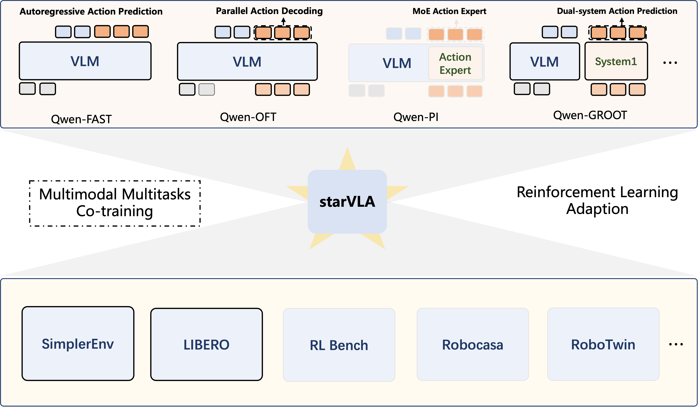

# StarVLA: A Lego-like Codebase for Vision-Language-Action Model Developing
StarVLA is a modular and flexible codebase for developing Vision-Language Model (VLM) to Vision-Language-Action (VLA) models.
In StarVLA (also a pun on “start VLA” ),  each functional component (model, data, trainer, config, evaluation, etc.) follows a top-down, intuitive separation and high cohesion and low coupling principle, which enabling plug-and-play design, rapid prototyping, and independent debugging.
The goal is to make VLA development as simple as building with Lego bricks—without modifying the global system—and to quickly integrate with a variety of benchmarks for validation.



*Modules with solid borders are supported; borderless ones are coming soon.


## 🔥 Key Features


<details open>
<summary><b>Various VLA Frameworks </b></summary>

- [x] **Qwen-FAST**: Utilizes Qwen2.5-VL-3B with a fast tokenizer to autoregressively generate discrete action tokens conditioned on visual and linguistic inputs (in line with RT-2/OpenVLA/π₀-fast).
- [x] **Qwen-OFT**: Combines Qwen2.5-VL-3B with an MLP action head to perform parallel decoding of continuous actions, regressed from the hidden states of predefined special action tokens (in line with OpenVLA-OFT/EO).
- [ ] **Qwen-FM**: Integrates the Flow-Matching (FM) action expert with Qwen2.5-VL-3B, adopting a diffusion-based approach for continuous action prediction (in line with π₀/GR-3).
- [ ] **Qwen-Dual**: Implements a dual-system VLA architecture, where Qwen2.5-VL-3B serves as System2 for high-level vision-language reasoning, while the Flow-Matching module acts as System1 for rapid action prediction (in line with GR00T/InternVLA-M1).


<p align="center">
  
</p>


</details>

<details close>
<summary><b>Various Simulation Benchmarks </b></summary>


- [x] **SimplerEnV**
- [x] **LIBERO**
- [ ] **Robocasa**
- [ ] **RLBench**
- [ ] **RoboTwin**
- [ ] **BEHAVIOR**

</details>


<details close>
<summary><b> Various Training Strategies </b></summary>

* [x] Single Imitation Learning
* [x] Multimodal Multitasks Co-training
* [ ] Reinforcement Learning Adaption

</details>


<!-- ## 🔍 Why StarVLA?


Pains in the community:
- Tight coupling of code: data / model / inference / environment are bound together, making migration and reuse costly 
- Opaque training / inference pipeline: forward / inference call chains are hard to trace  
- Non‑uniform benchmarks / baselines: inconsistent evaluation setups and data assumptions hinder fair comparison  
- High barrier for the broader CV/NLP community

<!-- StarVLA solutions:
- **Modular & Extensible**: Clear module boundaries; each (framework / dataloader / trainer / serving) can be understood & debugged in a single `python your_framwork.py`
- **Explicit & Traceable Pipeline**: 统一 `forward()/predict_action()` 入口，预处理集中在 framework；调用链易追踪
- **Unified Inference & Evaluation Interface**: WebSocket policy server + simulator adapters decouple training vs. evaluation and simulation vs. real robot, exposing a single action API -->

--- -->

## 🌟 How does starVLA make model development Lego-like again?
👇 StarVLA achieves “Lego-like” development via the following designs:

<a id="model"></a>
<details close>
<summary><b>1. Model: Modular & Extensible Framework</b></summary>

StarVLA emphasizes modular model design, following top‑down decomposition and a principle of high cohesion & low coupling. We define the following conventions:

1. `starVLA.model.framework.yourframework.py` is the only external API of the model; it should correspond to (be isomorphic with) the framework figure in your paper.  
2. Each `yourframework.py` or `module.py` can run standalone (e.g., `python yourframework.py` to demo forward + inference).  

</details>


<a id="data"></a>
<details close>
<summary><b>2. DataLoader: Model-Agnostic Data Processing</b></summary>

Best practice references: GR00T / LeRobot action data schemas; multimodal data can reuse LLaVA JSON style. Conventions:

1. Dataloader returns raw data: `PIL.Image`, `str`, normalized actions, state, etc. Must return a single dict
2. Any model‑specific preprocessing should not be processing in dataloader,  but only lives inside `yourframework.forward()`
Dataloader saves any data-processing contexts (normalization stats, transforms, etc.) to the output path.
3. Each `dataset.py` should been run standalone and print/validate one legal sample dict. e.g., `python lerobot_datasets.py`.

</details>


 
<a id="config"></a>
<details close>
<summary><b>3. Config System: Global & Extensible Unified Configuration</b></summary>

StarVLA uses a single global configuration object; all parameter accesses should follow absolute (fully qualified) keys.
The configuration is read from `config_yaml` and converted into an `OmegaConf DictConfig`, which permits redundancy, flexible grouping, and easy addition of new parameters.

Conventions:
1. Use `OmegaConf.load(args.config_yaml)` as the single configuration entry; standalone debugging also uses `args.config_yaml`.
2. Parameters may be intentionally redundant; you can freely add or override them via the CLI. Example:
`--framework.framework_py Qwen-OFT` to overwite and  `--framework.action_model.new_arg ${action_type}` for adding new arg.
3. Config snapshot: save the unified config in the output directory so experiments can be restarted quickly.

</details>


<a id="trainer"></a>
<details close>
<summary><b>4. Trainer: Lightweight & Strategy-Oriented</b></summary>

StarVLA’s trainer is built directly on native PyTorch + Accelerate + DeepSpeed, keeping the loop explicit and easy to hack.

Conventions:
1. Store runtime state in dicts where possible (simplifies data info, procesing info, config, etc).  
2. Use multiple dataloaders to adapt heterogeneous data types / task mixtures.  
3. Put each training strategy in its own `trainer_*.py` file (avoid large if‑else chains).  

</details>

<a id="inference"></a>
<details close>
<summary><b>5. Inference: Unified WebSocket Abstraction</b></summary>

StarVLA uses a unified WebSocket layer to decouple complex training and evaluation environments, providing an environment-agnostic inference interface (`deployment/model_server`) and simulator-specific adapters (e.g., `model2simpler_interface.py`).

Conventions:
1. `policy_server.py` exposes only the core inference call: `framework.predict_action()`  
2. Disallow ad‑hoc test‑time and simulator‑specific  on‑the‑fly parameter injection (e.g., extra un‑normalization flags, stats, execution heuristics) to preserve a stable, reproducible evaluation pipeline.
3. Provide per‑environment policy clients (e.g., `examples/SimplerEnv/model2simpler_interface.py`) that handle connection, request packing, retries, and action post‑processing for vairous benchmarks.

</details>


---

***To self‑test and iterate on StarVLA’s usability, we re‑implemented several representative VLA frameworks. Our usability target: an internal developer can stand up a new VLA framework in under half day, and an external user can build their first custom VLA framework within a single day.***


## 📖 FAQ

<details close>
<summary><b>Q: Why not put preprocessing in the dataloader?</b></summary>

A: We profiled it: data preprocessing takes <1% time. Keeping it inside the Framework is acceptable and allows model‑specific flexible handling.

</details>

<details close>
<summary><b>Q: Can I use a backbone other than Qwen2.5-VL?</b></summary>

A: Yes. Implement new vision + language modules and compose them inside a Framework; any base model can be swapped in (examples coming soon).
</details>

<details close>
<summary><b>Q: Can I freeze the VLM via parameters?</b></summary>

A: Yes. StarVLA uses a regex / name list to control freezing. Example:
```
--trainer.freeze_modules "qwen_vl_interface.model.model.visual,dino_encoder" \
```
(Comma‑separated; implementation in `TrainerUtils.freeze_backbones`.)

</details>

<details close>
<summary><b>Q: Can I set different learning rates for different modules?</b></summary>

A: Yes. Config example:
```yaml
trainer:
  learning_rate:
    base: 1e-05      # other modules
    qwen_vl_interface: 1.0e-05
    action_model: 1.0e-04
```
(Also referenced in `TrainerUtils.freeze_backbones`.)
</details>

<details close>
<summary><b>Q: Can I resume training from a checkpoint?</b></summary>

A: Yes. Specify the latest checkpoint path in `config.yaml`, e.g.:
```yaml
trainer:
  pretrained_checkpoint: path_to_steps_10000.pt
  reload_modules: "action_model,layer_qformer"
```
Empty means full load. (Optimizer state not saved to reduce memory/disk; limited benefit for loading Optimizer state.)
</details>


## ✍️ Citation
(BibTeX coming soon; placeholder)
```
@misc{starvla2025,
  title  = {StarVLA: A Lego-like Codebase for Vision-Language-Action Model Developing},
  author = {...},
  year   = {2025}
}
```


##  🙏 Acknowledgements
References & inspiration: LeRobot, GR00T, DeepSpeed, various open‑source VLM / control projects.  
Codebase originally forked from InternVLA-M1

